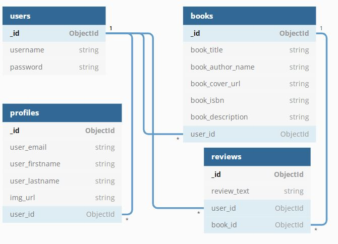
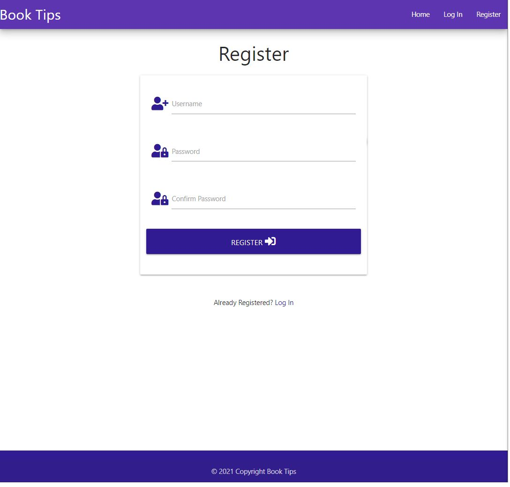
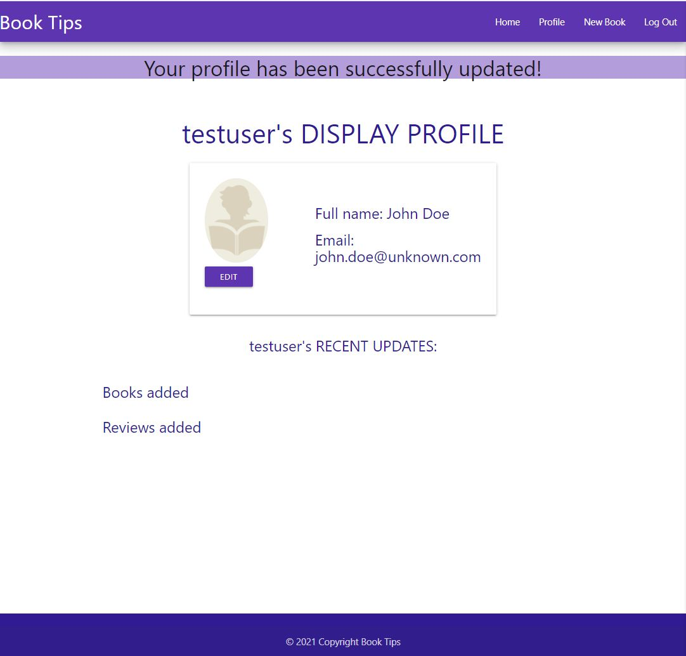
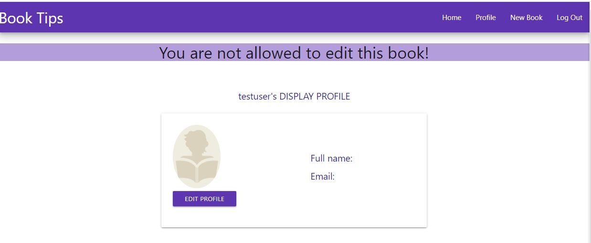

# Booktips


This project is the third Milestone Project in the "Python and Data Centric Development" course at <a href="https://codeinstitute.net/" target="_blank">Code Institute</a>.

**Book Tips** compiles the best and most popular books and creative reviews.
It’s a fun and interactive way to geek out over your favorite reads and discover all the coolest new titles you won’t find anywhere else.

The live website of [**Book Tips**](https://booktips-em.herokuapp.com/) can be viewed [here](https://booktips-em.herokuapp.com/)

---

## Index 

- <a href="#ux">1. User experience (UX)</a>
  - <a href="#ux-goals">1.1. Project goals</a>
  - <a href="#ux-stories">1.2 User stories</a>
  - <a href="#ux-design">1.3 Design</a>
  - <a href="#ux-architecture">1.4 Information architecture</a>
  - <a href="#ux-mockup">1.5 Mockup designs</a>
- <a href="#features">2. Features</a>
  - <a href="#features-existing">2.1 Existing features</a>
  - <a href="#features-future">2.2 Features left to implement in the future</a>
- <a href="#technologies">3. Technologies used</a>
- <a href="#testing">4. Testing</a>
- <a href="#deployment">5. Deployment</a>
- <a href="#credits">6. Credits</a>
- <a href="#Acknowledge">7. Acknowledge</a>
- <a href="#Acknowledge">8. Disclaimer</a>

---

<span id="ux"></span>

<h1>1. User experience (UX)</h1>

<span id="ux-goals"></span>

### 1.1 Project goals 

- Making a full-stack site that allows users to manage a common dataset about a particular domain. 
- Making a full-stack site that uses HTML, CSS, JavaScript, Python+Flask and MongoDB.

- Creating a website as a discovery tool for readers, highlighting the best new books.
- Creating a website that is simple to understand and easy to navigate.
- The users of the website can make use of CRUD (create, read, update and delete) for the books and reviews. 

<span id="ux-stories"></span>

### 1.2 User stories 

**First-time visitor/unregistered user goals:**
As a... | I want to... | To be able to...
---------|--------------|--------------
First Time Visitor | visit the website | see a list of books.
First Time Visitor | visit the website | see reviews on books.
First Time Visitor | search for a book | quickly find what I'm looking for
First Time Visitor | register on the website | add new books and write reviews.
<br>

**Registered user goals:** 

As a... | I want to... | To be able to...
---------|--------------|--------------
Registered User | login into the website | add new book
Registered User | login into the website | add reviews on books
Registered User | login into the website | change my reviews on books
Registered User | login into the website | delete my reviews on books
Registered User | login into the website | change my profile (password, photo, name, email)
Registered User | login into the website | delete my accountas well as reviews and votes
Registered User | find a list of options in the menu | use the website anytime and anywhere
Registered User | access the website from any device | delete my reviews on books
<br>


<span id="ux-design"></span>

### 1.3 Design 

- #### Colour scheme 
    Main colour palette:
    - #5e35b1 deep-purple darken-1;
    - #311b92 deep-purple darken-4;
    - #ede7f6 deep-purple lighten-5;
    - #01579b light-blue darken-4;
    - 

- #### Icons
The icons used in the project are provided by [Font Awesome](https://fontawesome.com/). The Icons have functional purposes, such as the hamburger menu. 

- #### Images
The images I used for this project came from [OpenLibrary](https://openlibrary.org/). Images are used for the home page and all the reviews. 

- #### Defensive design 

    - The user is not able to break the site by clicking on buttons. 
    - The signup form: 
        - The username must be between 5-15 characters and must only contain letters and numbers. 
        - The password must be between 5-15 characters and must contain at least one number, one uppercase and one lowercase letter.
    - The email address must be in the following format: characters followed by a @ symbol, followed by more characters and then a ".".

- #### Interactive design 

  - The website has to be easy to navigate. 
  - The user can quickly find the information he/she wants to find. 


<span id="ux-architecture"></span>

### 1.4 Database architecture
The project has four collections in the database. The database structure in MongoDB is as follows: 
- there are 4 collections: books, profiles, reviews, users;
- there are 2 indexes on book_title and book_author_name;
- there are relationships between collections as described below;

I used [DBDiagram](https://dbdiagram.io/d) to create a diagram of the database.
The code to produce the diagram is here:
```
Table users {
  _id ObjectId [pk]
  username string
  password string
}

Table profiles {
  _id ObjectId [pk]
  user_email string
  user_firstname string
  user_lastname string
  img_url string
  user_id ObjectId [ref: > users._id]
}

Table books {
  _id ObjectId [pk]
  book_title string
  book_author_name string
  book_cover_url string
  book_isbn string
  book_description string
  user_id ObjectId [ref: > users._id]
}

Table reviews {
  _id ObjectId [pk]
  review_text string
  user_id ObjectId [ref: > users._id]
  book_id ObjectId [ref: > books._id]
}
```
This is the diagram:



Other details about the database structure are in the [Deployment section](#deployment)


<span id="ux-mockup"></span>

### 1.5 Mockup designs
Mockup designs are made with [Balsamiq.](https://www.balsamiq.com/)

Initial wireframes with some comments for both desktop and mobile devices can be found [here](https://github.com/emusat2021/Booktips/tree/main/wireframes).

<span id="features"></span>

<h1>2. Features</h1>

<span id="features-existing"></span>

### 2.1 Existing features 

#### 2.1.1 Design 
- An attractive and simple layout with consistency.
- Simple navigation throughout the website by using the navigation bar. 
- Showing added books simple and clearly

#### 2.1.2 General 
- The home page shows an introductory text followed by a search box. Underneath there is a list of all books.
- Unregistered users are able to register on the "Register" page

#### 2.1.3 Books and Reviews
- Books and reviews can be created, read, updated and deleted (CRUD) by the users. 
- Users can search for Books using the search bar. 
- Users have access to their profile, with an overview of all their added books and reviews. 

#### 2.1.4 Register, login and logout 
- An unregistered user can create a new account on the web application.
- Registered users can login with their existing accounts. 
- Registered users can easily log out.
- If a user creates a new account, logs in or logs out, a flash message will appear as feedback for the user. 

<span id="features-future"></span>

### 2.2 Features left to implement in the future 
- Adding votes. Users vote their favorite books and can see them on their profile page. 
- Add categories for books. 
- Instead of using URLs for the book covers, we could implement a new feature to upload the cover as an image. 
- A book or a review should not be deleted by just one click. If someone clicks on the delete button, there will be a pop-up with a confirmation.
- Add pagination for the list of books and the list of reviews
- Add functionality for an Administrator account which is able to delete any book, review or profile
- When the user is logged in, write the user's username on the navbar
<span id="technologies"></span>

<h1>3. Technologies used</h1>

#### Languages used
- [HTML5](https://en.wikipedia.org/wiki/HTML5)
    - HTML5 provides the structure and the content for my project. 
- [CSS3](https://en.wikipedia.org/wiki/Cascading_Style_Sheets)
    - CSS3 provides the style of the HTML5 elements.
- [jQuery](https://jquery.com/)
    - jQuery used as the JavaScript functionality.
- [Python](https://www.python.org/)
    - Python provides the backend of the project.

#### Frameworks, libraries & Other
- [Gitpod](https://www.gitpod.io/) 
    - The GitPod is used to develop the project.
- [Git](https://git-scm.com/)
    - The Git was used for version control to commit to Git and push to GitHub.
- [GitHub](https://github.com/)
    - The GitHub is used to host the project.
- [Google Fonts](https://fonts.google.com/)
    - Google Fonts is used to provide the font roboto for all the text that is used in the project. 
- [Balsamiq](https://www.balsamiq.com/)
    - Figma is used to create the mockup designs for the project.
- [Materialize](https://materializecss.com/)
    - Materialize is used for the design framework.
- [MongoDB](https://www.mongodb.com/1)
    - MongoDB is the fully managed cloud database service used for the project.
- [Heroku](https://dashboard.heroku.com/)
    - Heroki is the cloud platform to deploying the app.
- [Flask](https://flask.palletsprojects.com/en/1.1.x/)
    - Flask is the web framework used to provide libraries, tools and technologies for the app.
- [Jinja](https://jinja.palletsprojects.com/en/2.11.x/)
    - Jinja is used for Python templating
- [Werkzeug](https://werkzeug.palletsprojects.com/en/1.0.x/)
    - Werkzeug is used for password hashing and authentication and autohorization.

#### Testing tools used 
- [Chrome DevTools](https://developers.google.com/web/tools/chrome-devtools/open) is used to detect problems and test responsiveness.
- [Autoprefixer](https://autoprefixer.github.io/)
    - Autoprefixer is used to parse the CSS and to add vendor prefixes to CSS rules. 
- [W3C Markup Validation Service](https://validator.w3.org/)
    - The W3C Markup Validation Service is used to check whether there were any errors in the HTML5 code. 
- [W3C CSS validator](https://jigsaw.w3.org/css-validator/)
    - The W3C CSS validator is used to check whether there were any errors in the CSS3 code.
- [JShint](https://jshint.com/)
    - JShint is a JavaScript validator that is used to check whether there were any errors in the JavaScript code. 
- [PEP8](http://pep8online.com/)
    - The PEP8 validator is used to check whether there were any errors in the Python code.
- [Black](https://pypi.org/project/black/)
    - Black is the uncompromising Python code formatter.
<span id="testing"></span>

<h1>4. Testing</h1>

### 4.1 Manual Testing 

#### 4.1.1 User stories testing
All the following manual testing was implemented on both desktop and mobile devices.

##### 4.1.1.1 All books and single book display
When I click on "All Books", I can see book cards displayed in rows, 3 books per row. In that page, I can see the book cover, book title and author name.
Clicking on the book card redirects me to the /book/view page, where I can see all the detailed information about the book, including the reviews. I tested this functionality as an unregistered user and as a logged in user and it worked in both cases.

##### 4.1.1.2 Create a new user account
I created my own account, as well as a few test accounts to test this functionality. Clicking on the "Register" button in the navbar opens the form, where I can put the desired username and password to create a new account. I tried to input an existing username, not matching passwords in "password" and "confirm password" fields, and input less than 5 or more than 15 charachters.
In all cases I got a corresponding feedback message. As well as that, I tried to leave an empty field and submit the form, but got an error message again asking to fill the field. When the form was successfully submitted, I was redirected to the home page, seeing a message that my new account was created.
I also checked the link to the Login page at the bottom of the form, which worked well. 

##### 4.1.1.3 Login
Clicking on the "Login" button in the navbar opens the form, allowing me to login to my account. I tried to leave empty fields or input incorrect details, but I was not able to submit the form if something was entered incorrectly. After a successful login I was redirected to the home page, seeing the message that I was logged in. 
##### 4.1.1.4 Change password
This functionality is located in the /profile/edit page.
I tried to write a different password than my own password and I received feedback that my current password was incorrect, thus I couldn't update my password.
I tried to put less than 5 characters and more than 15 characters on my new password and I got a feedback message, thus I couldn't update my password.
After I correctly put my current password and the new password, the password was updated successfuly and I was redirected to the /profile/edit page, as intended.
##### 4.1.1.5 Edit profile
This functionality is located in the /profile/edit page as a separate form.
I tried to put spaces in the First Name and Last Name fields and submit the from. I received a feddback message saying that I didn't have the proper format. 
I tried to write an invalid format for the email address and submit the form. I received feedback that the email address had incorrect format.
After I correctly fill in all the fields and submit the form, the profile was updated successfuly.


##### 4.1.1.6 Delete Account
I deleted some testing accounts to test the functionality. When clicking the "Delete account" button on the /profile/edit page, a modal appears. Clicking again on Delete account deletes my account. I checked the database and all the reviews and books created by the repsective user were removed as well.

##### 4.1.1.7 Add New Book
I added a few test books to check the functionality throughout the development.  If I leave some of the required fields empty, I will not be able to submit the form. I also tried to add a book without the URL image provided, to check if the placeholder is in place and it works well.
After I added a book, I got a feedback message saying that the book was added. 

##### 4.1.1.8 Edit Book
If I am the user who added the book in the first place, I can see the book in the /profile/view page, together with the buttons "Edit" and "Delete". I also tried to change the link manually in the browser to edit other's book. I received a feedback message stating that I am not allowed to edit the respective book.
Being the author of the book, I can view the form with pre-populated fields and can change anything that I want. I tried to edit a number of books and edit different fields, everything worked correctly.


##### 4.1.1.9 Delete Book
As an unauthenticated user I tried to delete a book by using the /delete_book/<book_id> page but I received a feedback message stating that I could not delete the book because I was not authenticated.
As an authenticated user I went to /profile/view where I have listed all my added books. I chose a book and clicked on the Delete button underneath. The book was successfully deleted. Also, all the reviews pertaining to that book were also deleted.

##### 4.1.1.10 View all Books
The link in the navbar leads to the home page, where I can see all the books and the search bar. All functionality works well.

##### 4.1.1.11 Add New Review
This functionality is implemented in the /book/view page. As an authenticated user, when clicking on the Add review button, I am redirected to //add_review/<book_id>page where I am presented with a form to add the review. After I write the review and submit the form, the review successfully apear in the database.
I verified that an unauthenticated user cannot add a review.

##### 4.1.1.12 Edit Review
This functionality is implemented in the /profile/view page, under the Reviews section. When clicking on the Edit button for a specific review, I am redirected to the /edit_review/<book_id> page. The form is pre-populated with the existing review. After making changes to the review text and submitting the form, the review is correctly updated in the database.

##### 4.1.1.13 Delete Review
This functionality is implemented in the /profile/view page, under the Reviews section. When clicking on the Delete button for a specific review, the review is deleted.

##### 4.1.1.14 View Reviews
An unauthenticated user can see all the reviews for a book on the /book/view page.
I tested this functionality by adding a few reviews to a book from different accounts and then checking that all the added reviews are displayed under the respective book.
An authenticated user can see all the reviews for a book on the /book/view page. Besides that, the user can see it's own reviews in the /profile/view page.
I tested the functionality on the /profile/view page by adding one review per book to multiple books and then checking that all the previously added reviews are shown on the /profile/view page.

##### 4.1.1.15 404 error
I manually changed the URL in the browser to get a non-existing page to test errors-handler function. Custom page loads and the link to the home page works well.

##### 4.1.1.16 Navbar
All links in the navbar were manually tested to ensure that they are pointing to the correct destination.   


Apart from that, I was manually testing the app with **debugger**: `debug=True` throughout all the development process. 
Every time when there was an error (when app crashed), the debugger displayed an error message to the view, that allowed me to find the location of the error and fix it.

#### 4.1.2 Further testing
I also asked my friends and family members to thoroughly test my website in different devices. So, a number of new accounts were created and new books/reviews were added/edited and some of them were deleted. 


### 4.2 Validators

#### 4.2.1 Html
All the HTML content of all the pages was tested through [W3C Markup Validation Service](https://validator.w3.org/#validate_by_input). No errors were found.

#### 4.2.2 CSS
CSS file was tested through [W3C CSS Validation Service](https://jigsaw.w3.org/css-validator/). No errors were found.

#### 4.2.3 JavaScript
JS file was tested through [Esprima](https://esprima.org/demo/validate.html) and [JSHint](https://jshint.com/) validators, code was syntactically valid.

#### 4.2.4 Python
All python files were tested through [PEP8 Online](http://pep8online.com/) validator and were completely PEP8 compliant.

### 4.3 Compatibility and Responsiveness
This website had been being tested during the development across **multiple browsers** (Chrome, Safary, Opera, FireFox) and on **multiple devices**: mobile (iPhone 5, 6, 8, Samsung Galaxy, Sony Xperia), tablets(iPad, iPadPro) and laptops (with HiDPI and MDPI and touch screens).     
As well as on **Google Chrome's developer tools** to see how it looks across all the different device screen sizes to ensure compatibility and responsiveness.   
I also used [Am I Responsive](http://ami.responsivedesign.is/) online tool for checking responsiveness on different devices.   
Plenty of changes were made and necessary media queries added to make the website fully responsive.   

<span id="deployment"></span>

<h1>5. Deployment</h1>

#### Requirements 
- Python3 
- Github account 
- MongoDB account 
- Heroku account

#### Clone the project 
To make a local clone, follow the following steps. 
1. Log in to GitHub and go to the repository. 
2. Click on the green button with the text **"Code".**
3. Click on **"Open with GitHub Desktop"** and follow the prompts in the GitHub Desktop Application or follow the instructions from **[this link](https://docs.github.com/en/free-pro-team@latest/github/creating-cloning-and-archiving-repositories/cloning-a-repository#cloning-a-repository-to-github-desktop)** to see how to clone the repository in other ways. 

#### Working with the local copy
1. Install all the requirements: Go to the workspace of your local copy. In the terminal window of your IDE type: **pip3 install -r requirements.txt**.
2. Create a database in MongoDB  
    - Signup or login to your MongoDB account.
    - Create a new Database called "Booktips" in [MongoDB Atlas](https://www.mongodb.com/). .
    - In the "Booktips" database create the following four collections: **books, profiles, reviews, users.**
        ###### Books
        ```
        {
            _id: <ObjectId>,
            book_title: <String>,
            book_author_name: <String>,
            book_cover_url: <String>,
            book_isbn: <String>,
            book_description: <String>,
            user_id: <ObjectId>,
        }
        ```
        ###### Profiles
        ```
        {
            _id: <ObjectId>,
            user_email: <String>,
            user_firstname: <String>,
            user_lastname: <String>,
            img_url: <String>,
            user_id: <ObjectId>,
        }
        ```
        ###### Reviews
        ```
        {
            _id: <ObjectId>,
            review_text: <String>,
            user_id: <ObjectId>,
            book_id: <ObjectId>,
        }
        ```
        ###### Users
        ```
        {
            _id: <ObjectId>,
            username: <String>,
            password: <String>,
        }
        ```
    - You need to manually create indexes in books collection, for the *book_title* and *book_author_name*, otherwise you will not be able to perform a search in the database within those fields.
        ```
        $ python3

        from app import mongo
        mongo.db.books.create_index([("book_title", "text"), ("book_author_name", "text")])
        ```
3. Create the environment variables 
    - Create a .gitignore file in the root directory of the project.
    - Add the env.py file in the .gitignore.
    - Create the file env.py. This  will contain all the environment variables.
    ```
    import os
    os.environ.setdefault("IP", "Added by developer")
    os.environ.setdefault("PORT", "Added by developer")
    os.environ.setdefault("SECRET_KEY", "Added by developer")
    os.environ.setdefault("MONGO_URI", "Added by developer")
    os.environ.setdefault("MONGO_DBNAME", "Added by developer")
    ```
4. Run the app: Open your terminal window in your IDE. Type python3 app.py and run the app.

#### Heroku Deployment  
1. Set up local workspace for Heroku 
    - In terminal window of your IDE type: ```pip3 freeze -- local > requirements.txt.``` (Heroku detects this as a Python app. The reason that they've been able to detect Python is because we have a requirements.txt file)

    - In terminal window of your IDE type: ```echo "python app.py" > Procfile``` (The file is needed for Heroku to know which file is needed as entry point.)
1. Set up Heroku: create a Heroku account, create a new app and select your region. 
2. Deployment method 'Github'
    - Click on the **Connect to GitHub** section in the deploy tab in Heroku. 
        - Search your repository to connect with it.
        - When your repository appears click on **connect** to connect your repository with the Heroku. 
    - Go to the settings app in Heroku and go to **Config Vars**. Click on **Reveal Config Vars**.
        - Enter the variables contained in your env.py file. it is about: **IP, PORT, SECRET_KEY, MONGO_URI, MONGO_DBNAME**
3. Push the requirements.txt and Procfile to the repository. 
     ```
    $ git add requirements.txt
    $ git commit -m "Add requirements.txt"

    $ git add Procfile 
    $ git commit -m "Add Procfile"
    ```
4. Automatic deployment: Go to the deploy tab in Heroku and scroll down to **Automatic deployments**. Click on **Enable Automatic Deploys**. By **Manual deploy** click on **Deploy Branch**.

Heroku will receive the code from Github and host the app using the required packages. 
Click on **Open app** in the right corner of your Heroku account. The app wil open and the live link is available from the address bar. 


<span id="credits"></span>

<h1>6. Credits</h1>

#### Content
- Text in Home page - [Reedsy](https://reedsy.com/discovery/blog/book-review-sites)
- Text in Home page - [Bookpage](https://bookpage.com/)

#### Media 
- Books images and descriptions
    - [OpenLibrary](https://openlibrary.org).
    - [Goodreads]https://www.goodreads.com
- Default book cover
    - https://twitter.com/openbookpublish


#### Code
- [Mini Project | Putting It All Together_Tim Nelson_CodeInstitute](https://github.com/Code-Institute-Solutions/TaskManagerAuth)
- [Stack Overflow](https://stackoverflow.com/)
- [Materialize](https://materialize.com/)

<span id="Acknowledge"></span>

<h1>7. Acknowledge</h1>

- I received support for this project from my mentor <a href="https://www.codeinstitute.net/" target="_blank">[Precious Ijege](https://www.linkedin.com/in/precious-ijege-908a00168/?originalSubdomain=ng) at [Code Institute](https://codeinstitute.net)</a>.
- My husband Bogdan Musat and son David Musat for their immense support, patience and love!
- All friends and family that took the time to test this for me.

<span id="Disclaimer"></span>

<h1>8. Disclaimer</h1>
This project is for educational use only. 

<a href="#booktips">Back to top!</a>
